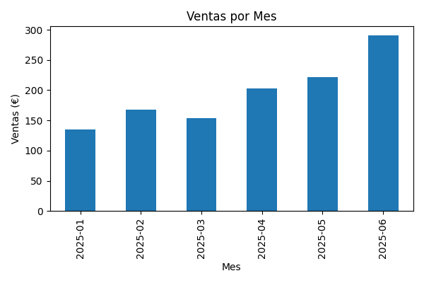
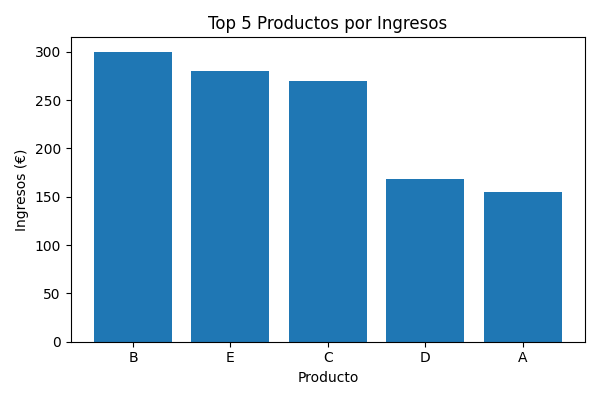

# Informe de Ventas Mensuales

## Introducción

Este informe presenta un análisis de las ventas realizadas durante el primer semestre del año 2025. El análisis se ha realizado utilizando datos sintéticos de transacciones comerciales, procesando información sobre productos vendidos, cantidades, precios y fechas de venta. El objetivo es identificar tendencias mensuales, determinar los productos con mayor volumen de ventas y los que generan mayores ingresos para la empresa.

Se han analizado las ventas agrupadas por mes y se han identificado los productos más relevantes según diferentes métricas, generando visualizaciones que facilitan la interpretación de los resultados.

## Resultados

### Ventas por Mes

La siguiente tabla muestra el total de ventas (en euros) para cada mes del período analizado:

| Mes | Ventas (€) |
|-----|------------|
| 2025-01 | 135.00 |
| 2025-02 | 168.00 |
| 2025-03 | 154.00 |
| 2025-04 | 203.00 |
| 2025-05 | 222.00 |
| 2025-06 | 291.00 |

### Análisis de Productos

Se identificaron los productos más destacados según diferentes métricas:

- **Producto más vendido en unidades**: El producto **A** fue el más vendido con un total de **31 unidades**.
- **Producto con mayores ingresos**: El producto **B** generó los mayores ingresos con un total de **300.00 €**.

## Conclusiones

El análisis de los datos sintéticos de ventas revela tendencias importantes en el comportamiento comercial:

1. **Tendencia de crecimiento mensual**: Las ventas muestran una clara tendencia al alza a lo largo del semestre, con un crecimiento sostenido desde enero (135.00 €) hasta junio (291.00 €), lo que representa un incremento del 115.6% en el período analizado.

2. **Desempeño de productos**: Existe una diferencia notable entre el producto más vendido en unidades (producto A con 31 unidades) y el producto que genera mayores ingresos (producto B con 300.00 €). Esto sugiere que el producto B tiene un precio unitario más elevado, lo que compensa un menor volumen de ventas en términos de unidades.

3. **Evolución temporal**: El mes de junio presenta el mejor desempeño con 291.00 € en ventas, seguido de mayo con 222.00 € y abril con 203.00 €, indicando una aceleración del crecimiento en los últimos meses del período.

4. **Recomendaciones**: Se recomienda mantener el enfoque en el producto B debido a su alta contribución a los ingresos, mientras que el producto A representa una oportunidad para aumentar las ventas por volumen. El análisis de estos datos sintéticos proporciona una base para la toma de decisiones estratégicas en la gestión de inventario y estrategias de marketing.

---

*Nota: Los datos utilizados en este análisis son sintéticos y están destinados únicamente con fines de demostración y análisis metodológico.*
